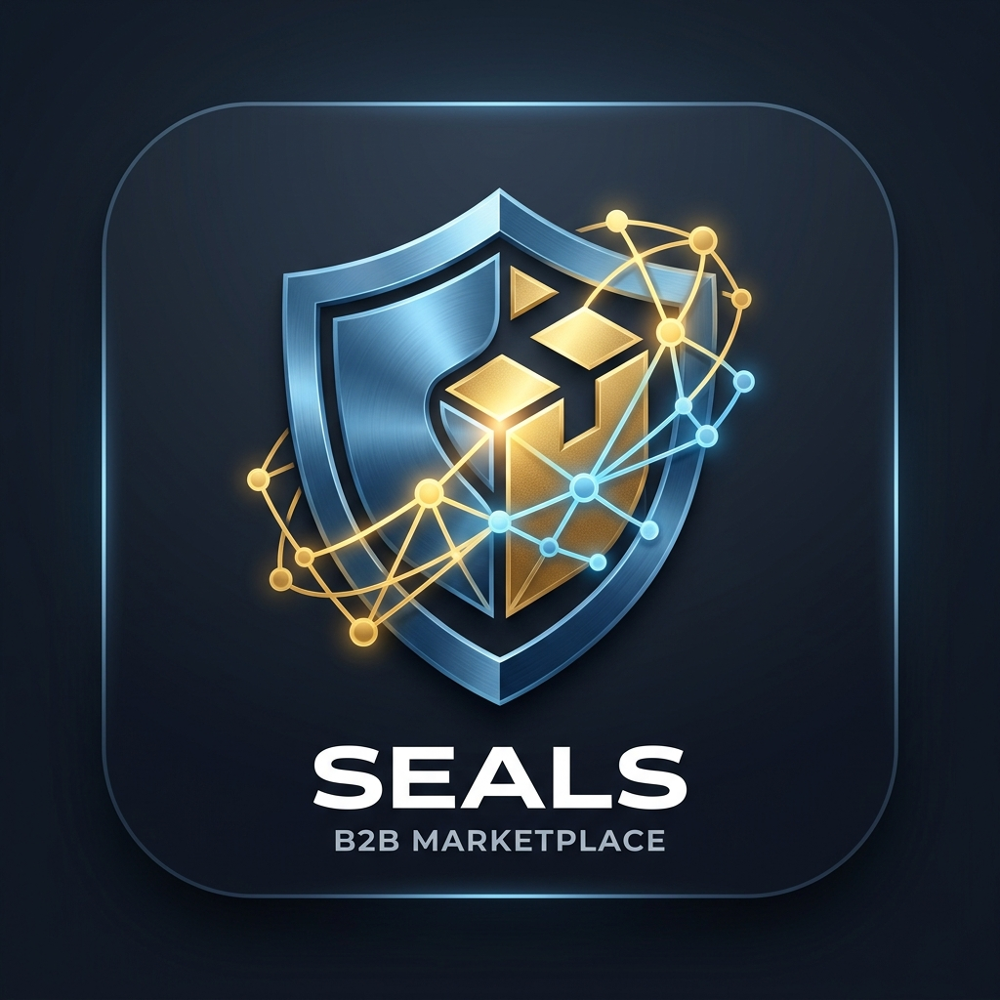
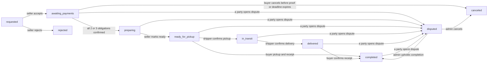
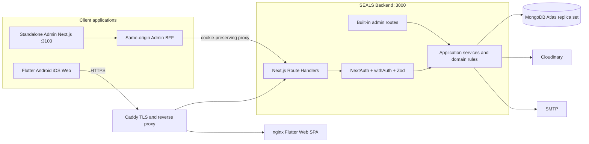

<p align="center">
  
</p>

<h1 align="center">SEALS B2B Marketplace</h1>

<p align="center">
  منصة SaaS متعددة الأطراف لتنظيم تجارة الجملة بين التجار والمشترين التجاريين وشركات الشحن في مصر.
  <br />
  <em>A multi-sided SaaS marketplace for Egypt's wholesale trade.</em>
</p>

<p align="center">
  <a href="https://github.com/mahmoud-adel-dev/EGYMarket_B2B_FlutterAPP/actions/workflows/ci.yml"></a>
  
  
  
  
</p>

> [!IMPORTANT]
> المشروع في مرحلة **Advanced MVP / production-oriented** وليس إعلانًا عن جاهزية قانونية أو تشغيلية نهائية.
> الدفع الحالي محلي قائم على إثبات التحويل والمراجعة؛ المنصة لا تحتفظ بأموال البائع أو شركة الشحن،
> ولا تمثل بوابة دفع أو Escrow.

## نظرة عامة

يجمع SEALS دورة تجارة الجملة في نظام واحد: اكتشاف الموردين والمنتجات، أسعار الكميات والحد الأدنى
للطلب، السلة وطلب الشراء، إثباتات الدفع المحلية، حجز المخزون، الشحن، غرفة متابعة الطلب، النزاعات،
التقييمات، والتشغيل الإداري. كل منشأة تملك نطاق بيانات مستقلًا، وتُحسب الأسعار والرسوم على الخادم
بالقرش المصري بدل الاعتماد على قيم يرسلها العميل.

### نموذج العمل

- اشتراك للمنشآت من الأنواع الثلاثة: تاجر جملة، مشتري تجاري، وشركة شحن.
- رسم منصة افتراضي قدره **50 جنيهًا** على طلب الجملة، ويمكن تغييره من إعدادات المنصة.
- التزامان للدفع عند الاستلام الذاتي: رسم المنصة وقيمة البضاعة.
- ثلاثة التزامات عند الشحن الخارجي: رسم المنصة، البضاعة، والشحن.
- التحويل يتم مباشرة إلى المستفيد عبر InstaPay أو محفظة أو تحويل بنكي أو وسيلة محلية مهيأة.
- تُحفظ حسابات تحصيل المستفيد كلقطة ثابتة عند قبول الطلب حتى لا تتغير تعليمات طلب قائم لاحقًا.

## الأطراف داخل المنصة

| الطرف | القيمة التي يحصل عليها | أهم العمليات |
|---|---|---|
| تاجر الجملة `Wholesaler` | متجر رقمي وكتالوج وتسعير كميات ومؤشرات أداء | إدارة المنتجات، قبول الطلب، مراجعة دفع البضاعة، تجهيز الطلب، المحتوى والتقييمات |
| المشتري التجاري `Retailer` | اكتشاف موردين وشراء جملة منظم وقابل للتتبع | سلة ضيف، طلب شراء، دفع الرسوم والسلع، الاستلام، النزاع، تقييم المورد |
| شركة الشحن `Shipper` | إدارة التعريفات والطلبات المسندة | تسعير المحافظات، استلام الشحنة، محطات التتبع، تأكيد التسليم ومراجعة دفع الشحن |
| مدير المنصة `Admin` | رقابة تشغيلية ومالية موحدة | توثيق المنشآت، فواتير الاشتراك، رسم المنصة، النزاعات، الإعدادات وسجل التدقيق |

## المميزات الأساسية

| المجال | ما هو منفذ حاليًا |
|---|---|
| الهوية والعزل | NextAuth بجلسات HttpOnly، تسجيل متعدد الأدوار، تحقق البريد، قفل محاولات الدخول، RBAC وعزل على مستوى المنشأة |
| توثيق المنشآت | رفع المستندات، حالات مراجعة واضحة، اعتماد/رفض/تعليق من الإدارة |
| الاشتراكات | تجربة عند التسجيل، خطط وفواتير، إثبات دفع يدوي، مراجعة إدارية، وحراسة عمليات التداول الأساسية |
| كتالوج الجملة | صور وفيديو، SKU، MOQ، شرائح سعر كمية، وحدة البيع، الخصم، المخزون، زمن التجهيز، المواصفات وFAQ |
| البحث والاكتشاف | بحث وفلترة وترتيب وترقيم صفحات، دليل الموردين، وتوصيات rule-based تصبح شخصية للمشتري |
| السلة والشراء | سلة محلية للضيف، سلة خادم بعد الدخول، تحقق MOQ والمخزون، استلام ذاتي أو شحن طرف ثالث |
| محرك الطلب | State machine محكومة بالأدوار، حجز ذري للمخزون عند القبول، commit عند الاستلام، وrelease عند الإلغاء |
| الدفع المحلي | التزامات منفصلة، مرجع وصورة إثبات، تأكيد/رفض المستفيد، انتقال تلقائي للتجهيز بعد اكتمال التأكيدات |
| الشحن والنزاعات | تعريفات حسب المحافظات، أحداث تتبع نصية، تأكيد الاستلام والتسليم، ونزاع يحسمه مدير المنصة |
| التواصل | استفسار مرتبط بالمنتج، غرفة خاصة بالطلب، unread counts، polling للرسائل والإشعارات داخل التطبيق |
| المجتمع التجاري | منشورات صور/فيديو، إعجاب وتعليق، متابعة المورد، وتقييم تاجر الجملة بعد طلب مكتمل |
| التحليلات والإدارة | مبيعات وربح إجمالي تقديري ومخزون منخفض وأداء الأصناف، ولوحة Super Admin مستقلة وتقارير CSV |
| الخصوصية والتدقيق | تصدير بيانات، طلب حذف مجدول مع pseudonymization، وسجل للعمليات الإدارية الحساسة |

## دورة الطلب والدفع



- لا يدخل المشتري غرفة الطلب الخاصة قبل تأكيد رسم المنصة؛ يظل استفسار المنتج متاحًا كمسار منفصل.
- ينتقل الطلب إلى `preparing` فقط بعد تأكيد كل الالتزامات المطلوبة.
- الاسترداد الحالي يتم خارج المنصة، ثم يسجل المدير حالته `refund_pending → refunded`.
- جميع انتقالات الحالة الحساسة تستخدم شروطًا ذرية، وتُحمى آثار المخزون من التكرار.

للتفاصيل: [Order Lifecycle](docs/ORDER_LIFECYCLE.md) · [Payment Flow](docs/PAYMENT_FLOW.md).

## البنية التقنية الحالية



### Design pattern

البنية المقترحة للتوسع هي:

1. **Feature-first Clean Architecture** داخل Flutter باستخدام Cubit وDio وطبقة DI مشتركة.
2. **DDD-oriented Modular Monolith** للباك إند بدل تقسيم مبكر إلى Microservices.
3. **Ports & Adapters** لعزل MongoDB وCloudinary وSMTP وأي مزودات مستقبلية.
4. **BFF Pattern** للوحة الإدارة حتى تبقى جلسة NextAuth داخل نفس الأصل.
5. **Transactional Outbox** للأحداث الموثوقة، ثم CQRS انتقائي للبحث والتقارير فقط.
6. **Strangler Fig evolution** لاستخراج خدمات مثل الإشعارات أو البحث عند وجود سبب قياسي حقيقي.

المخططات، Bounded Contexts، عقود الأحداث وخطة الانتقال المرحلية موثقة في
[Scalable Architecture & Evolution](docs/SCALABLE_ARCHITECTURE.md).

## هيكل المستودع

| المسار | التقنية | المسؤولية |
|---|---|---|
| [`app/`](app/) | Flutter stable · Dart ≥ 3.12.2 · Bloc/Cubit · Dio | تطبيق Android/iOS/Web والواجهات الخاصة بكل دور |
| [`backend/`](backend/) | Next.js 16 · TypeScript strict · Mongoose · NextAuth | API، قواعد النطاق، المعاملات، المهام الإدارية، وواجهة `/admin` المدمجة |
| [`admin-panle/`](admin-panle/) | Next.js 16 · React 19 · TanStack Query · Recharts | لوحة Super Admin مستقلة عبر BFF؛ اسم المجلد legacy ومحفوظ حاليًا للتوافق |
| [`docs/`](docs/) | Markdown · Mermaid | وثائق المعمارية، الأمان، API، الطلب، الدفع، التشغيل والنشر |
| [`.github/workflows/ci.yml`](.github/workflows/ci.yml) | GitHub Actions | فحص الباك إند وFlutter وصور Docker الحالية |

## المتطلبات

- Node.js 24 وnpm.
- Flutter stable مع Dart `>= 3.12.2`.
- MongoDB محلي للتطوير أو MongoDB Atlas؛ Replica Set مطلوب لضمان المعاملات متعددة المستندات.
- Cloudinary لرفع الميديا الحقيقي، وSMTP للتحقق من البريد واستعادة الحساب في البيئات المكتملة.

## التشغيل المحلي الموحد

```powershell
git clone https://github.com/mahmoud-adel-dev/EGYMarket_B2B_FlutterAPP.git
cd EGYMarket_B2B_FlutterAPP
```

من جذر المستودع شغّل الأمر التالي؛ سيبدأ الـbackend واللوحة المستقلة وFlutter Chrome في الخلفية:

```powershell
npm run local:start:build
```

بعد أول بناء، يكفي استخدام `npm run local:start`. لإيقاف الخدمات كلها:

```powershell
npm run local:stop
```

السجلات محفوظة داخل `.local-logs/`.

### الخدمات والروابط

| الخدمة | الرابط المحلي |
|---|---|
| Flutter Web | `http://localhost:5173` |
| API readiness | `http://localhost:3000/api/health/ready` |
| الإدارة المدمجة | `http://localhost:3000/admin/login` |
| لوحة الإدارة المستقلة | `http://localhost:3100/login` |

لإنشاء مدير محلي تفاعليًا، استخدم من الجذر:

```powershell
npm run local:admin
```

سيُستخدم الاسم `memo` والبريد `memo@seals.local` افتراضيًا. كلمة المرور يجب أن تكون 12 حرفًا أو أكثر؛
كلمة `123456` مرفوضة عمدًا لأن الحساب مدير وقاعدة البيانات الحالية قد تكون مشتركة وليست محلية.

حسابات العرض وآلية Seed موثقة في [MVP Demo Data](docs/MVP_DEMO_DATA.md).

## الاختبارات والبناء

```powershell
# Backend
cd backend
npm run lint
npm test
npm run build

# Flutter
cd ..\app
dart format --output=none --set-exit-if-changed .
flutter analyze
flutter test
flutter build web --release --dart-define=ALLOW_LOCAL_PRODUCT_MODE=true # local verification only

# Standalone Admin
cd ..\admin-panle
npm run lint
npm run build
```

GitHub Actions يفحص الباك إند واختبارات MongoDB/chaos وFlutter ولوحة `admin-panle/` وصور Docker.
تبقى إضافة اللوحة المستقلة إلى بيئة Docker الموحدة قرار نشر منفصل؛ بناؤها محمي الآن داخل CI.

## النشر

نشر Docker الحالي يغطي API وFlutter Web وCaddy:

```bash
cp .env.production.example .env.production
cp backend/.env.production.example backend/.env.production
docker compose --env-file .env.production up -d --build
```

لوحة `admin-panle/` تُبنى وتُنشر حاليًا كتطبيق Next.js مستقل مع ضبط `API_BASE_URL` على أصل الباك إند.
راجع [Deployment Guide](docs/DEPLOYMENT.md) و[Production Runbook](docs/PRODUCTION_RUNBOOK.md).

## خارطة التوسع

| المرحلة | الهدف |
|---|---|
| تثبيت الـMVP | E2E على staging وخدمات الطرف الثالث، إكمال تجربة reset-password، استكمال ترجمة الإنجليزية، وتحسين التشغيل والمراقبة |
| أداء واكتشاف | Atlas Search أو محرك بحث Adapter، Cache مقاس بالبيانات، projections للتقارير، وتحسين التوصيات دون ادعاء ML |
| تواصل لحظي | SSE/WebSocket للشات، Push Notifications عبر Adapter مستقل، وworker موثوق للـOutbox |
| تكاملات السوق | مزودو دفع مصريون، شركات شحن وخرائط عند توفر عقود API، مع بقاء الإثبات اليدوي كخيار fallback |
| فصل انتقائي | استخراج Communications أو Search أولًا فقط عند وجود ضغط أو احتياج عزل، ثم Saga للطلب إذا انفصلت الخدمات الجوهرية |

> [!NOTE]
> الشات والإشعارات حاليًا تعتمد على polling، والتوصيات rule/query-based وليست نموذج ML، ولا يوجد GPS حي أو
> دفع بطاقات أو استرداد آلي داخل النظام حتى الآن.

## فهرس التوثيق

- [Architecture](docs/ARCHITECTURE.md) · [Scalable Architecture](docs/SCALABLE_ARCHITECTURE.md)
- [API](docs/API.md) · [Authorization](docs/AUTHORIZATION.md) · [Security](docs/SECURITY.md)
- [Order Lifecycle](docs/ORDER_LIFECYCLE.md) · [Payment Flow](docs/PAYMENT_FLOW.md)
- [Feature Matrix](docs/FEATURE_MATRIX.md) · [MVP Acceptance](docs/MVP_ACCEPTANCE.md)
- [Testing](docs/TESTING.md) · [Environment Variables](docs/ENVIRONMENT_VARIABLES.md)
- [Docker](docs/DOCKER.md) · [Deployment](docs/DEPLOYMENT.md) · [Backup & Restore](docs/BACKUP_RESTORE.md)
- [Production Runbook](docs/PRODUCTION_RUNBOOK.md) · [Enterprise Audit](docs/ENTERPRISE_AUDIT.md)
- [Mobile Release](app/docs/RELEASE_BUILD.md) · [Final Verification 2026-08-29](docs/FINAL_VERIFICATION_REPORT_2026-08-29.md)

## الأمان والخصوصية

- لا تُرفع ملفات `.env` أو مفاتيح MongoDB وCloudinary وNextAuth إلى Git.
- يتحقق الخادم من الدور والمنشأة والعضوية في المسارات المحمية؛ الواجهة ليست مصدر صلاحية.
- كل مبالغ الطلب والتسعير ورسوم المنصة والشحن محسوبة على الخادم بالقرش.
- توجد حدود للمحاولات على التسجيل والدخول والاستعادة والرفع، مع Request IDs وسجلات تدقيق للقرارات الحساسة.
- المستندات القانونية داخل المنتج مسودة تشغيلية، ويجب اعتمادها من محامٍ مصري قبل الإطلاق العام.

## الترخيص

لا يتضمن المستودع حاليًا ترخيص Open Source. جميع الحقوق محفوظة لصاحب المشروع ما لم يُضف ملف
`LICENSE` ينص على غير ذلك.
