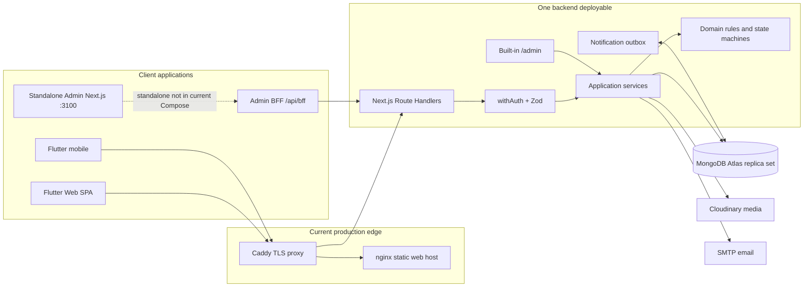
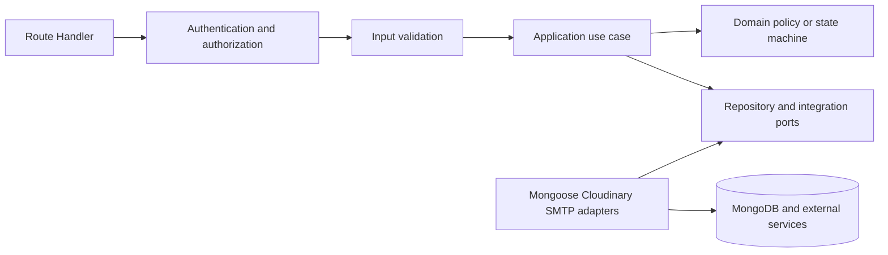
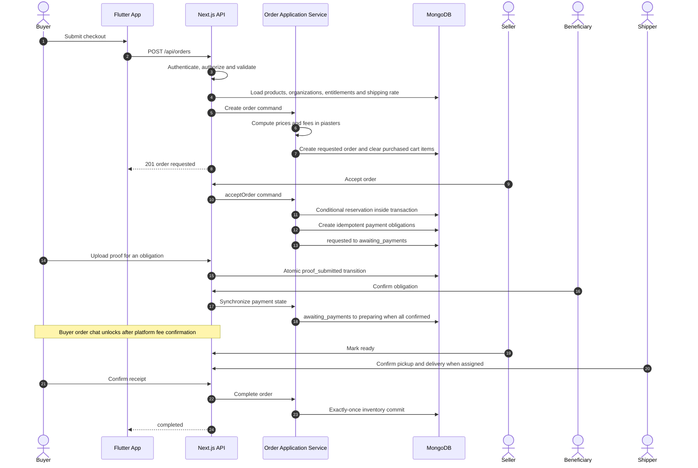
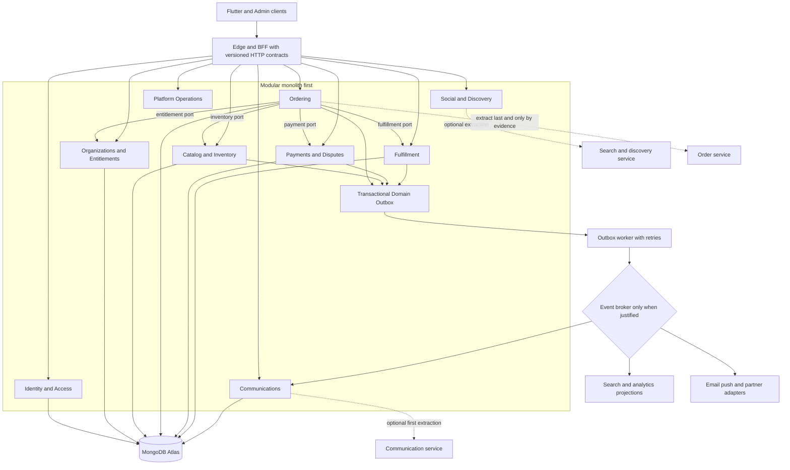
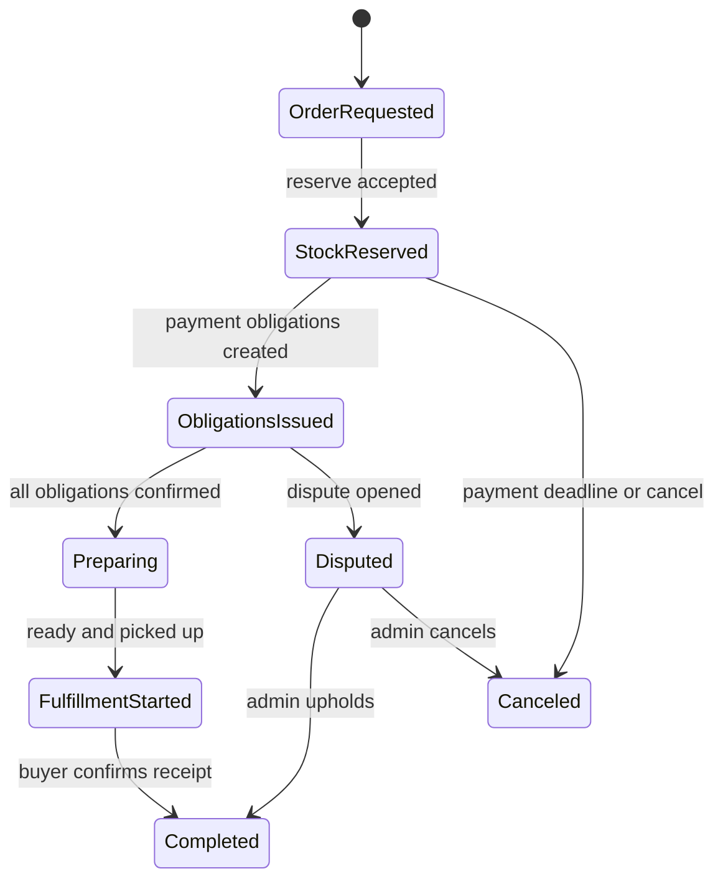

# SEALS Scalable Architecture & Evolution

> **Status:** Proposed architecture direction for the current Advanced MVP<br />
> **Decision:** DDD-oriented Modular Monolith + Ports & Adapters + Transactional Outbox<br />
> **Last updated:** 2026-08-22

هذه الوثيقة تشرح كيف يتوسع SEALS من بنيته الحالية دون إعادة كتابة خطرة أو تقسيم مبكر إلى Microservices.
الهدف هو حماية قواعد المال والمخزون والطلب، مع إنشاء حدود واضحة يمكن أن تتحول إلى خدمات مستقلة عندما
توجد أسباب تشغيلية قابلة للقياس.

## 1. القرار المعماري

يبقى الباك إند في المراحل الأولى **تطبيقًا واحدًا قابلًا للنشر وقاعدة MongoDB واحدة**، لكنه يُنظّم حول
Bounded Contexts ذات ملكية واضحة. تتواصل الوحدات عبر Application Ports معلنة، وتبقى Route Handlers
وMongoose ومزودات Cloudinary/SMTP مجرد Adapters.

الآثار الجانبية التي لا يجب أن تعطل المسار الحرج تنتقل تدريجيًا عبر **Transactional Outbox**. لا نضيف
Message Broker أو خدمة مستقلة إلا عند وجود مستهلكين مستقلين أو ضغط أو حاجة عزل أعطال حقيقية.

هذا الاختيار يحافظ على معاملات MongoDB الحالية حول المخزون والطلب والدفع، ويمنحنا seams يمكن تحويلها
لاحقًا إلى APIs أو Events دون تغيير عقود العميل.

### Pattern stack

| الطبقة | النمط | الغرض |
|---|---|---|
| Flutter | Feature-first Clean Architecture + Cubit | عزل حالة وعرض كل Feature مع Core مشترك صغير |
| HTTP/API | Thin Route Handlers | المصادقة والتحقق وتحويل HTTP فقط؛ لا قواعد نطاق داخل Route |
| Backend | DDD-oriented Modular Monolith | سرعة تطوير ونشر واحدة مع ملكية نطاق واضحة |
| Integrations | Ports & Adapters | تبديل Mongo/Cloudinary/SMTP/Search/Push دون تسريب تفاصيل المزود |
| Admin | Backend for Frontend `BFF` | إبقاء NextAuth cookies داخل نفس الأصل وتبسيط عقود لوحة الإدارة |
| Async work | Transactional Outbox | تسليم at-least-once مع deduplication بدل dual writes غير الموثوقة |
| Heavy reads | Selective CQRS | Projections للبحث والتقارير فقط، وليس نسخ النظام كله إلى read/write models |
| Service extraction | Strangler Fig | استخراج وحدة واحدة خلف عقد ثابت دون big-bang rewrite |

## 2. البنية الحالية



ملاحظات الحالة الحالية:

- `backend/app/api/**/route.ts` يمثل HTTP adapters.
- `withAuth` يعيد اشتقاق الدور والمنشأة والعضوية من MongoDB لكل طلب محمي.
- Zod schemas تمثل حدود الإدخال، وApplication Services تدير المعاملات وسير العمل.
- قواعد انتقال الطلب مستقلة في `backend/lib/orders/order_rules.ts`.
- `NotificationOutbox` يحتوي بيانات ومنطق retry/dead-letter/idempotent delivery، لكن لا يوجد حاليًا
  worker مجدول يعالج backlog العام، كما أنه ليس بعد Domain Outbox ذريًا مع كل تغيير Aggregate.
- الشات والإشعارات داخل التطبيق تستخدم polling حاليًا؛ لا يوجد WebSocket/SSE transport.
- لوحة `admin-panle/` مستقلة عبر BFF ومشمولة في CI، لكنها ليست ضمن Docker Compose أو Caddy الحاليين.

### Dependency direction



قاعدة الاعتماد المستهدفة: الـDomain لا يستورد Next.js أو Mongoose أو SDK خاصًا بمزود خارجي. يمكن
للبنية الحالية الانتقال إلى هذه القاعدة تدريجيًا؛ لا يلزم نقل كل الملفات مرة واحدة.

## 3. Bounded Contexts

| السياق | ما يملكه | حدود المسؤولية |
|---|---|---|
| Identity & Access | User، credentials، sessions، verification tokens، global roles | يثبت هوية الممثل ولا يملك قرارات النشاط التجاري |
| Organizations & Entitlements | Organization، Membership، verification، plans، subscriptions، invoices | يجيب: هل المنشأة موثقة ومسموح لها بتنفيذ العملية؟ |
| Catalog & Inventory | Product، pricing tiers، availability، reservation/commit policies | المالك الوحيد لتغيير المخزون والمحجوز |
| Ordering | Cart، Order aggregate، snapshots، state machine | ينسق مسار الشراء المتزامن ويثبت أسعار وعناصر الطلب |
| Payments & Disputes | Payment obligations، proofs، confirmation، refund state، disputes | يحافظ على نموذج non-custodial ولا يقرأ مبالغ من العميل |
| Fulfillment | Shipping rates، assignment، tracking events، pickup strategy | يعزل الاستلام الذاتي عن الشحن الخارجي ومزوداته المستقبلية |
| Communications | Conversations، messages، notifications، delivery outbox | المرشح الطبيعي الأول للتوسع أو الاستخراج المستقل |
| Social & Discovery | Posts، likes، comments، follows، ratings، feed، recommendations | نطاق قراءة كثيف مناسب لـprojections والبحث لاحقًا |
| Platform Operations | Settings، audit، analytics، privacy maintenance، admin workflows | يراقب السياقات ولا يتجاوز Command APIs الخاصة بها عند الكتابة |

### قواعد الملكية

1. لا توجد كتابة مباشرة إلى Collection يملكها Context آخر من صفحة أو Route.
2. كل Context يعلن `public.ts` أو Application Port صغيرًا لاستخدام الوحدات الأخرى.
3. الاستعلام المتزامن مسموح داخل نفس الـdeployable عندما يكون مطلوبًا لقرار مالي أو صلاحية.
4. الأحداث تستخدم للآثار الجانبية والـread models، وليس لإخفاء function call عادي داخل الوحدة نفسها.
5. عند استخراج خدمة، تصبح المالك الحصري لبياناتها؛ الخدمات الأخرى تستخدم API/Events ولا تقرأ Collections.

## 4. المسار الحرج للطلب



### Invariants that must survive every architecture phase

- Money remains integer piasters end-to-end.
- Price, platform fee and shipping cost remain server-authoritative.
- Seller acceptance cannot reserve more than the currently available stock.
- Inventory reservation, release and commit remain idempotent business effects.
- Order state changes pass one canonical transition policy; Routes never set `status` directly.
- Payment obligations remain unique by order and kind, and snapshot beneficiary accounts.
- Every protected query remains organization-scoped; client-supplied IDs are never sufficient authorization.
- Admin decisions affecting money, verification or disputes remain auditable.

## 5. البنية المستهدفة دون Big Bang



المربعات ذات كلمة extraction ليست خدمات حالية؛ هي seams مستقبلية فقط.

## 6. شكل الوحدة المستهدف

```text
backend/
  app/api/                              # HTTP adapters only
  modules/
    ordering/
      domain/                           # aggregate, value objects, policies, events
      application/                      # commands, queries, ports
      infrastructure/                   # Mongoose repositories and adapters
      public.ts                         # only cross-module import surface
    catalog/
    payments/
    fulfillment/
    communications/
  shared/
    kernel/                             # Money, IDs and event envelope only
    infrastructure/                     # DB, logging and outbox runner
```

لا ننشئ Generic Repository لكل Model. نضيف Port عندما توجد حدود نطاق أو حاجة اختبار/استبدال حقيقية.

## 7. Domain Events وTransactional Outbox

عند إنشاء تغيير يحتاج آثارًا جانبية:

1. يحفظ Application Service الـAggregate وOutbox record في نفس MongoDB transaction.
2. يلتقط Worker السجلات بحالة `pending` ويجدد lease قصيرًا.
3. يرسل الحدث at-least-once إلى المستهلك المحلي أو الـbroker.
4. يسجل المستهلك `event_id` في Inbox أو يستخدم unique operation key لمنع تكرار الأثر.
5. retry يستخدم exponential backoff، وبعد الحد ينتقل إلى dead-letter مع visibility إدارية.

Event envelope المقترح:

```json
{
  "event_id": "uuid",
  "event_type": "ordering.order.accepted.v1",
  "aggregate_id": "order-id",
  "organization_id": "tenant-id",
  "occurred_at": "ISO-8601",
  "trace_id": "request-id",
  "payload": {}
}
```

قواعد العقود:

- `event_type` يحمل اسم النطاق والحدث والإصدار.
- الأحداث حقائق بصيغة الماضي، وليست أوامر مبهمة.
- إضافة حقول اختيارية backward-compatible؛ التغيير الكاسر ينشئ `v2`.
- لا تحمل الأحداث كلمات مرور أو cookies أو مستندات حساسة كاملة.
- يحتفظ المنتج المالك بعقد JSON Schema أو Zod واختبار Contract لكل إصدار.

## 8. CQRS وقراءات الأداء

يظل write model هو مصدر الحقيقة. نستخدم projections فقط عندما يصبح query محدد مكلفًا أو له نمط توسع مختلف:

| القراءة | البداية | التطور المحتمل |
|---|---|---|
| كتالوج المنتجات | MongoDB indexes + pagination | Atlas Search أو Search Adapter مستقل |
| Feed والتوصيات | Query/rule-based | materialized engagement projection ثم ranking service |
| تقارير الإدارة | Aggregations على الخادم | event-fed analytics store أو warehouse |
| عدادات unread | MongoDB aggregation | Redis/read projection بعد قياس الضغط |

لا نضيف Cache بلا سياسة invalidation ومؤشر hit rate. ولا نحول checkout أو قرارات المخزون والدفع إلى
eventual consistency ما دام transaction واحد يستطيع حماية القرار.

## 9. Multi-tenancy وتوسع البيانات

الوضع الحالي المناسب للـMVP هو Shared Database / Shared Collections مع مفاتيح Organization وفهارس مركبة.

- كل read/write محمي يضيف organization scope من Auth Context.
- الفهارس تبدأ بـorganization key للاستعلامات الخاصة بالمنشأة عندما يكون ذلك مناسبًا.
- snapshots المالية داخل الطلب والالتزام تمنع تغير التاريخ بتغير المصدر.
- يمكن إضافة archival policy للرسائل والأحداث القديمة دون حذف سجلات التدقيق المالية.
- عميل Enterprise يحتاج عزلاً ماديًا فقط عند وجود عقد أو تنظيم أو حجم يبرره؛ حينها يقدم Tenant Router
  اختيار cluster/database خلف Repository Port دون تغيير Domain.

## 10. خطة التطور المرحلية

| المرحلة | التغيير | شرط الانتقال | Rollback |
|---|---|---|---|
| 0 — Baseline | ADRs، ownership map، request IDs، latency/error metrics، اختبارات characterization | قبل أي نقل ملفات كبير | لا تغيير runtime |
| 1 — Module seams | نقل Context واحد إلى `modules/*` مع `public.ts` وthin routes | عقود API والاختبارات ثابتة | إعادة imports إلى الخدمة القديمة |
| 2 — Reliable events | تعميم NotificationOutbox إلى Domain Outbox ذري + worker + inbox | وجود side effects متكررة أو dual-write risk | تشغيل المستهلك داخل نفس process |
| 3 — Async read side | نقل البريد والإشعارات والبحث والتقارير إلى consumers | قياس latency/حجم القراءة أو عزل الأعطال | إعادة القراءة للمصدر الأساسي |
| 4 — First extraction | Communications أو Search كخدمة مستقلة | نشر مستقل أو scaling أو failure isolation مثبت | توجيه الـadapter إلى implementation المحلي |
| 5 — Distributed workflow | Process Manager/Saga للطلب عند انفصال Inventory/Payments/Fulfillment | فرق ونشر وقواعد بيانات مستقلة فعليًا | إبقاء orchestration داخل Order module |

### ترتيب الهجرة المقترح

1. Communications/Notifications: أقل اقترانًا بالمعاملات المالية.
2. Social/Discovery/Search projections: قراءة كثيفة وقابلة لإعادة البناء.
3. Media processing: Adapter/worker مستقل عند زيادة الفيديو والصور.
4. Analytics: مستهلك أحداث ومستودع قراءة منفصل.
5. Catalog read side، ثم Fulfillment integrations.
6. Ordering/Payments/Inventory أخيرًا وبعد اختبارات تكامل ومنافسة قوية.

## 11. متى نُخرج Microservice؟

يجب تحقق سبب واحد على الأقل مع بيانات:

- فريق مستقل يحتاج دورة نشر مختلفة بانتظام.
- throughput أو storage profile مختلف ماديًا عن بقية النظام.
- أعطال الوحدة تتسبب في تعطيل المنصة وتحتاج isolation مستقلًا.
- حدود تنظيمية/تعاقدية تتطلب ملكية بيانات أو شبكة منفصلة.
- database contention مستمر بعد تحسين الاستعلامات والفهارس.

زيادة عدد الملفات أو الرغبة في استخدام تقنية جديدة ليست سببًا كافيًا.

## 12. Saga عند الفصل المستقبلي

لا نستخدم Distributed Transactions بين الخدمات. إذا انفصلت النطاقات، يدير Order Process Manager الخطوات:



كل command يحمل `operation_id`، وكل consumer idempotent. التعويضات هي `release reservation` و
`cancel obligations` و`mark refund pending`، وليست rollback موزعًا وهميًا.

## 13. Observability وSLO readiness

قبل الفصل نحتاج قياسًا موحدًا:

- correlation/request ID يمر عبر HTTP وevent envelope.
- structured logs مع `context`, `operation`, `organization_id` بعد إخفاء البيانات الحساسة.
- metrics: request latency/error rate، DB latency، outbox lag، retry/dead-letter، payment review age،
  stock reservation conflicts، order transition conflicts، chat polling volume.
- traces للمسارات الحرجة: create order، accept، payment confirmation، receipt، dispute resolution.
- health: liveness للعملية وreadiness لـMongo والمزودات الحرجة.

تُحدد أرقام SLO بعد وجود production baseline؛ لا نخترع أهدافًا بلا بيانات.

## 14. Security guardrails

- تبقى NextAuth cookies HttpOnly/Secure في الإنتاج، ولا ننقل session token إلى Local Storage.
- كل خدمة مستقبلية تتحقق من actor/tenant ولا تثق في organization header من العميل مباشرة.
- service-to-service authentication قصير العمر مع audience محدد عند ظهور أول خدمة مستقلة.
- secrets في Secret Manager أو environment injection، لا في events أو logs أو repository.
- least privilege لمستخدمي MongoDB وCloudinary وSMTP ولكل worker.
- immutable audit trail للقرارات الإدارية والمالية، مع retention policy معلنة.

## 15. Guardrails ضد Overengineering

- لا Microservices أو Kubernetes أو Kafka أو Event Sourcing أو database-per-module الآن.
- لا Generic Repository طبقي لمجرد إخفاء Mongoose.
- لا events بدل function calls داخل Context واحد.
- لا eventual consistency لمسار checkout الحرج دون ضرورة.
- لا استخراج لخدمة دون ownership وSLO وrunbook وon-call وrollback path.
- لا كسر لعقود Flutter/Admin؛ تستخدم versioning أو strangler routing خلال الانتقال.

## 16. Definition of Done لكل Migration Slice

- عقد HTTP الحالي لم يتغير أو وُثقت نسخة جديدة.
- اختبارات unit وcontract وintegration للمسار نجحت.
- أزيلت direct imports المخالفة، وأصبح `public.ts` هو السطح الوحيد بين الوحدات.
- invariant المال/المخزون/العزل له اختبار منافسة أو idempotency مناسب.
- metrics وlogs وalerting وrollback موثقة.
- فشل المستهلك أو المزود الخارجي لا يفقد الحدث ولا يكرر business effect.
- تم تحديث [Architecture](ARCHITECTURE.md) و[Feature Matrix](FEATURE_MATRIX.md) وrunbook ذي الصلة.

## 17. Architecture Decision Records المقترحة

```text
docs/adr/
  0001-modular-monolith-first.md
  0002-money-in-piasters.md
  0003-nextauth-cookie-sessions.md
  0004-transactional-outbox.md
  0005-selective-cqrs.md
  0006-service-extraction-criteria.md
```

كل ADR يسجل Context وDecision وConsequences والبدائل المرفوضة. تغيير القرار يتم عبر ADR جديد، لا حذف
التاريخ.

---

**الخلاصة:** نبني حدود Microservices الآن، لا Microservices نفسها. نحافظ على deployable واحد ومعاملات
واضحة حتى تثبت البيانات ضرورة الفصل، ثم نستخرج أقل Context مخاطرة خلف Ports وعقود Events موثقة.
